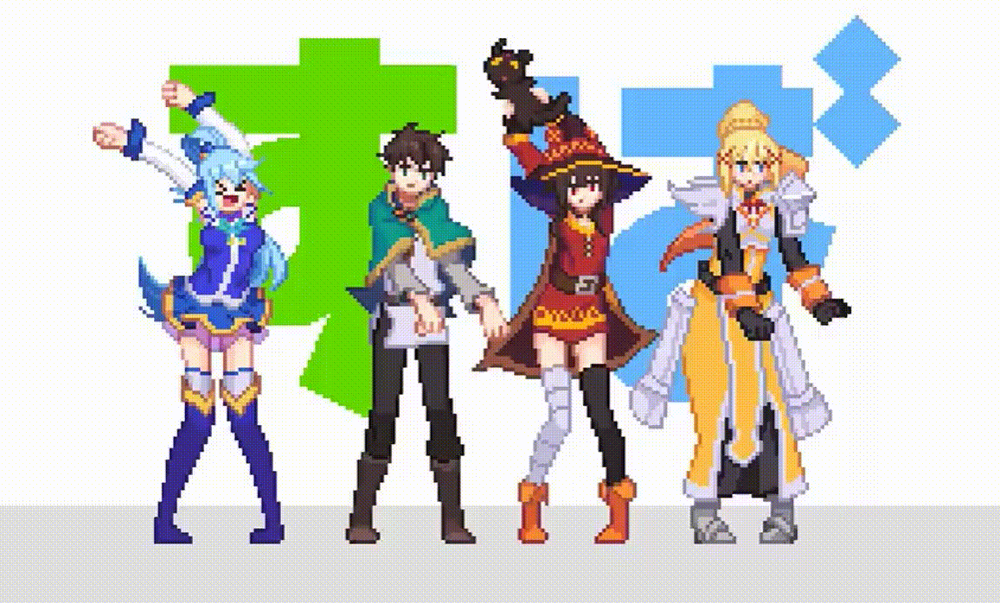

<p align="center">
<a href="https://github.com/kawarimidoll/typograssy">
    
  </a>
</p>


<p align="center">
  
</p>

---

<p align="center">
  
</p> 

```bash
🔥 sai@cyber-machine: ~/neural_profile (main⚡)$ neofetch
```

```diff
+ My Profile ver. 2.0.1: 
- ----------------------------------------------------------------------------------------
! Username: Sai Prashanth
+ WhoamI: Game Developer. Also Technical Artist (more or less)
! OS: Windows 11 with PowerShell
+ Shell: pwsh 7.0+
! GitHub: @SaiiPrashanth
+ Focus: Graphics Programming, Game Mechanics, Performance Optimization
! Languages: C++, C#, JavaScript, Python, 
+ Engines: Unreal Engine 5, Unity 6
! Tools: Max, Maya, RenderDoc, Houdini, Gaea, World Machine, Speedtree, Git, Photoshop, Illustrator
+ Current Project: Render Engine (Not yet named!) 
! Learning: Cuda, PBR Rendering, Houdini, Procedural Generation
+ Hobbies: Gaming, Badminton
! Motto: "Stay Cool !"
+ Favorite Equation: (Dot Product) a⋅b=∣a∣∣b∣cos(θ)
- Status: Memory Overflow
```

<p align="center">
  
</p>
<p align="center">
  
</p>
<p align="center">
  
</p>


---

<p align="center">
  
</p>


<p align="center">
  
</p>

<p align="center">
  
</p>

<p align="center">
  
</p>

---

<p align="center">
  
</p>
<!-- Snake (enable workflow first) -->
<p align="center">
  
</p>

---

<p align="center">
  
</p>
<p align="center">
  <a href="https://saiiprashanth.github.io/"></a>
  <a href="mailto:saiiprashanth23@gmail.com"></a>
  <a href="https://www.linkedin.com/in/saiiprashanth/"></a>
</p>
<p align="center">
  <a href="https://discord.com/users/Saiiprashanth"></a>
  <a href="https://www.artstation.com/saiiprashanth"></a>
  <a href="https://saiiprashanth.itch.io/"></a>
</p>

<p align="center">
  
</p>

---


